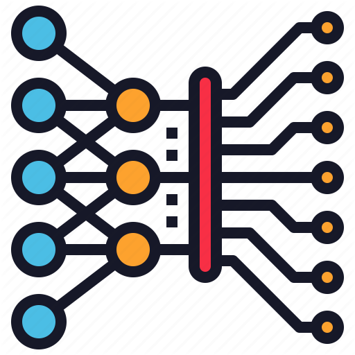

<!-- PROJECT SHIELDS -->

  
  

<!-- PROJECT LOGO -->
 

  

  <h3 align="center">IA: Reconocimiento de objetos en imágenes</h3>

  

    Un pequeño proyecto de prueba de <a href="https://github.com/OlafenwaMoses/ImageAI" target="_blank">ImageAI</a>. Una librería open-source de Python.
  

<!-- ABOUT THE PROJECT -->
## Sobre el proyecto

Este proyecto es una prueba de Machine Learning y demo de detección de objetos en imágenes. Basado en [este artículo](https://towardsdatascience.com/object-detection-with-10-lines-of-code-d6cb4d86f606).

### Creado con

**Lenguaje de Programación**

<ul>
  <li>
    <a href="https://python.org/"> <b>Python</a> (v3.7).</b> Un lenguaje de programación orientado a objetos, comparable a Perl, Ruby, Scheme o Java.
  </li>
</ul>

**DevOps:**

<ul>
  <li>
    <a href="https://docker.com/"> <b>Docker</a>.</b> Un proyecto de código abierto para automatizar la implementación de aplicaciones como contenedores portátiles y autosuficientes que pueden ejecutarse en la nube o en diversos dispositivos.
  </li>
</ul>

<!-- LICENSE -->
## Licencia

Distribuido bajo los términos de la licencia MIT. Vease [`LICENSE`](LICENSE) para más información.
